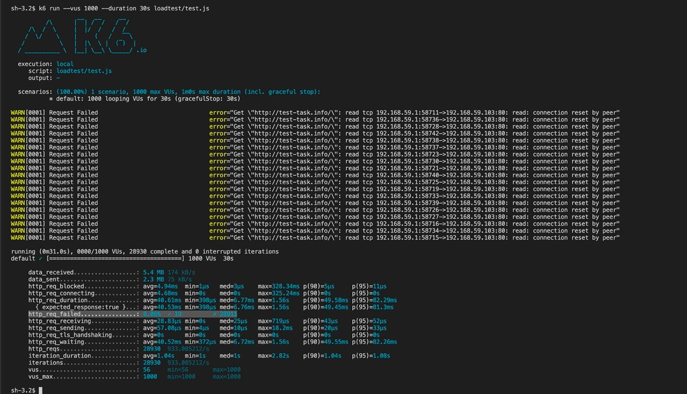
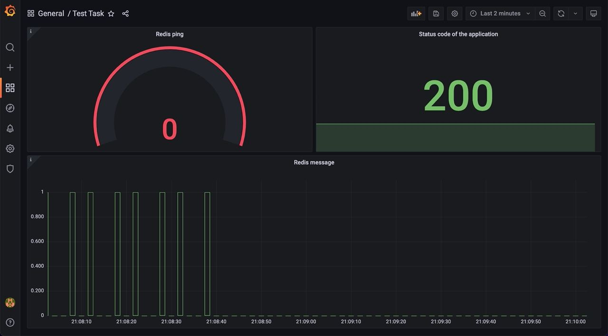
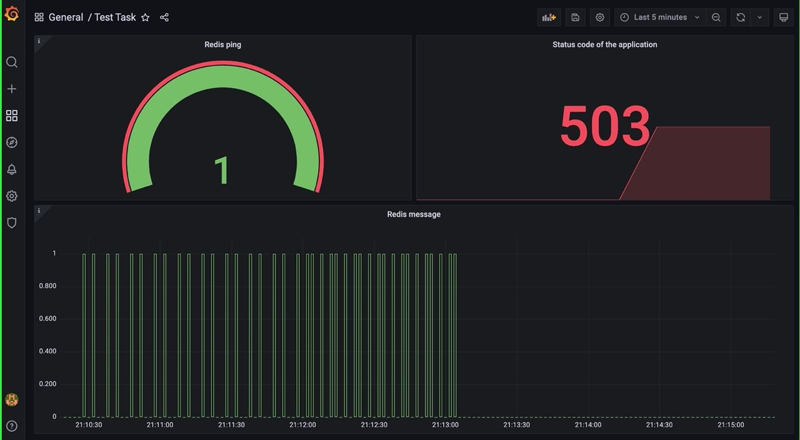
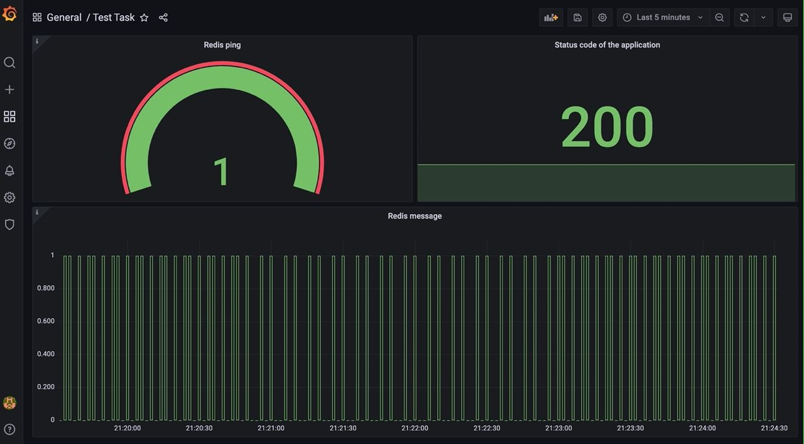

# Devops Test

### Overview
This is an application that is a dummy webservice that returns the
last update time.  The last updated time is cached in redis and
resets every 5 seconds.  It has a single '/' endpoint.  The redis
address is passed in through the environment.

NOTE: The following tasks are estimated to take no more than 3 hours total.

### Tasks
1. Create Dockerfile for this application
2. Create docker-compose.yaml to replicate a full running environment 
so that a developer can run the entire application locally without having
to run any dependencies (i.e. redis) in a separate process.
3. Explain how you would monitor this application in production. 
Please write code/scripts to do the monitoring.

### Kubernetes(MiniKube) Tasks
4. Prepare local Kubernetes environment (using MiniKube) to run our application in pod/container. 
Store all relevant scripts (kubectl commands etc) in your forked repository.
5. Suggest & create minimal local infrastructure to perform functional testing/monitoring of our application pod.
Demonstrate monitoring of relevant results & metrics for normal app behavior and failure(s).

Please fork this repository and make a pull request with your changes.

Please provide test monitoring results in any convenient form (files, images, additional notes) as a separate archive.

### Results
1. Done. Check ./Dockerfile
2. Done. Check ./docker-compose.yml
3. I am interested to use a side-car container with a Prometheus exporter. This solution allows us not to change the source code of the application and has monitoring of it. The application such simple, so I decided to write 3 types of tests:
    - ping of Redis. This is checking connectivity. We can have problems with either Redis or the application itself 
    - Getting a record from Redis. I want to know if we have a problem bettwen the application and the Redis. The normal value is changing from zero to one in 5 seconds. If we detected that the value does not change during 10 second, we need make alert
    - Request to application itself. Here we are health checking of the application
    - Additionally, we can get more information if we configure the Prometheus-ingress exporter. 
4. The code below
```
minikube start --driver=virtualbox
minikube addons enable ingress
helm repo add prometheus-community https://prometheus-community.github.io/helm-charts && helm repo update
helm install --create-namespace -n monitoring  -f ./k8s/values.yaml prometheus prometheus-community/kube-prometheus-stack
docker build -t test-task/web_app:1.0.0 .
docker build -t test-task/mon_app:1.0.0 monitoring/.

# The best solution was to push my images to docker hub (or some local corporative registry, e.g. harbor), but I decided not to do it and just copy images to nodes
docker save test-task/mon_app > mon_app.tar
docker save test-task/web_app > web_app.tar
scp -i $(minikube ssh-key) mon_app.tar docker@$(minikube ip):~/.
scp -i $(minikube ssh-key) web_app.tar docker@$(minikube ip):~/.
minikube ssh
docker load < mon_app.tar
docker load < web_app.tar
exit 

kubectl apply -f k8s/deployment.yaml
#But with production application is better to write a helm chart
#After that, you need to find out the IP addresses and FQDN of ingress
kubectl get ingress -n monitoring 
kubectl get ingress -n test-task
#And write to file. It should look like <IP FQDN>
sudo vi /etc/hosts
# E.g. 192.168.59.103 test-task.info and futher
#After that, you can open web applications such as prometheus.info prometheus.info test-task.info, or test-task-mon.info (the last FQDN can be hidden because we don't need to show it all the world)
```
5.  I decided to use k6 like performance testing tools. I wrote some simple script and run it 
```
brew install k6
k6 run --vus 1000 --duration 30s loadtest/test.js 
```



Demonstrate monitoring of relevant results & metrics for normal app behavior and failure(s).

The 1st scenario. Redis is down:





The 2nd scenario. Application is down:





THe 3rd scenario. Redis and applications recovered:


